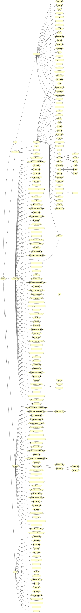

# Permissionless Blockchains-based Healthcare Security Ontology
OWL-DL, and permissionless blockchains based healthcare security ontology, HealthOnt. The HealthOnt models the system and business assets, security criteria, threats, vulnerabilities, countermeasures, and their relationships by extending the ULRO (https://mmisw.org/ont/~mubashar/ULRO). The HealthOnt gives reasoning in natural language about the encoded concepts of healthcare application's information security, and answers the competence questions such as: What assets to secure? Which system asset supports business assets? Which particular threat exploits which vulnerability? Which permisionless blockchain-based countermeasure mitigates which vulnerability? What threats and vulnerabilities may appear in blockchain-based healthcare applications? and What are the countermeasures to mitigate the vulnerabilities? HealthOnt is published in the journal paper: [Ontological Representation of Healthcare Application Security Using Blockchain Technology](https://doi.org/10.15388/22-INFOR486).

## SPARQL queries
The SPARQL queries can be used to retrieve information from the HealthOnt. The following header code will remain the same for all the queries listed in this section.

```sql
PREFIX rdf: <http://www.w3.org/1999/02/22-rdf-syntax-ns#>
PREFIX owl: <http://www.w3.org/2002/07/owl#>
PREFIX rdfs: <http://www.w3.org/2000/01/rdf-schema#>
PREFIX xsd: <http://www.w3.org/2001/XMLSchema#>
PREFIX HealthOnt:
        <https://mmisw.org/ont/~mubashar/HealthOnt#>
```

### System assets
The following SPARQL query retrieves the system assets that support the business assets.

```sql
SELECT DISTINCT ?SystemAsset ?BusinessAsset
WHERE {
    ?SystemAsset rdfs:subClassOf HealthOnt:SystemAsset .
    ?SystemAsset rdfs:subClassOf ?BusinessAsset .
    ?BusinessAsset owl:onProperty HealthOnt:supports .
}
```

### Business assets
The following SPARQL query gets the business assets that have the security criteria constraint.

```sql
SELECT DISTINCT ?BusinessAsset ?Constraint
WHERE {
    ?BusinessAsset rdfs:subClassOf HealthOnt:BusinessAsset .
    ?BusinessAsset rdfs:subClassOf ?Constraint .
    ?Constraint owl:onProperty HealthOnt:hasConstraint .
    { ?Constraint owl:someValuesFrom
                HealthOnt:Confidentiality . } UNION  
    { ?Constraint owl:someValuesFrom
                HealthOnt:Integrity . } UNION  
    { ?Constraint owl:someValuesFrom
                HealthOnt:Availability . }
}
```

### Threats mitigated
The following SPARQL query brings the threats that are mitigated by using the blockchain. The query result shows the threats mitigated, associated vulnerabilities, and system assets that are targeted by the threats.

```sql
SELECT DISTINCT ?Threat ?Vulnerability ?SystemAsset
WHERE {
    ?Threat rdfs:subClassOf ?Vulnerability .
    ?Threat rdfs:subClassOf ?SystemAsset .
    ?Vulnerability owl:onProperty HealthOnt:exploits .
    ?SystemAsset owl:onProperty HealthOnt:targets .
    ?Threat rdfs:seeAlso ?Domain .
    FILTER regex(?Domain, "^Mitigated") 
}
```
### Threats appeared
The following SPARQL query brings the threats that are appeared within a blockchain-based. The query result shows the threats appeared, associated vulnerabilities, and system assets that are targeted by the threats.

```sql
SELECT DISTINCT ?Threat ?Vulnerability ?SystemAsset
WHERE {
    ?Threat rdfs:subClassOf ?Vulnerability .
    ?Threat rdfs:subClassOf ?SystemAsset .
    ?Vulnerability owl:onProperty HealthOnt:exploits .
    ?SystemAsset owl:onProperty HealthOnt:targets .
    ?Threat rdfs:seeAlso ?Domain .
    FILTER regex(?Domain, "^Appeared") 
}
```

### Countermeasures
The following SPARQL query brings the list of countermeasures to mitigate the threats.

```sql
SELECT DISTINCT ?Countermeasure ?Mitigates
WHERE {
    ?Countermeasure rdfs:subClassOf
                            HealthOnt:Countermeasure .
    ?Countermeasure rdfs:subClassOf ?Mitigates .
    ?Mitigates owl:onProperty HealthOnt:mitigates .
}
```

## Class hierarchies
HealthOnt "is-a" based taxonomical structure illustrates the class hierarchies.



## V1
HealthOnt version 1 is related to the published paper: [Blockchain as a countermeasure solution for security threats of healthcare applications](https://link.springer.com/chapter/10.1007/978-3-030-85867-4_6)

## How to use?
Download [Protégé](https://protege.stanford.edu) editor. Load/import [HealthOnt](https://mmisw.org/ont/~mubashar/HealthOnt) in Protégé and navigate to the *Entities* tab to explore the encoded security risk management concepts.